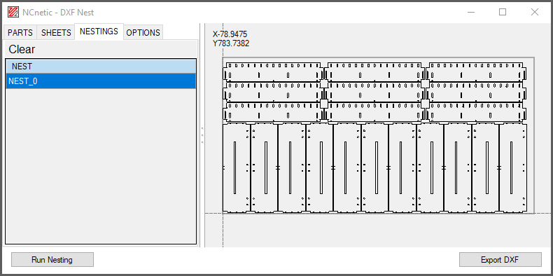

# DXFnest – The DXF Nesting Dialog

A Windows desktop dialog for nesting DXF parts.

DXFnest is part of the **[NCnetic](https://ncnetic.com)** software suite.

---

## How It Works

1. Load your DXF files  
2. Manage your sheets  
3. Get the best (or at least not too bad 😉) placements  
4. Export the result as a DXF  

---

## Technical Information

This project is a refactoring of the [DeepNestPort](https://github.com/fel88/DeepNestPort?tab=readme-ov-file) project (which itself is a port of [DeepNest / SVGnest](https://github.com/Jack000/SVGnest)) with the following changes:

- New GUI / interface
- Improved heuristics for nesting repetitive shapes  
- Arc preservation during nesting and export — vital for CAM applications
- New shape *envelope* calculations to reduce node count, especially for geometries containing arcs  
- Use of the [ACadSharp](https://github.com/DomCR/ACadSharp) library to handle DXF files (import & export)  
- [Clipper2](https://github.com/AngusJohnson/Clipper2) C# library used for geometric calculations  
  (already present in the original DeepNestPort, but worth mentioning)
- Pure C# implementation
  
## License

This project is licensed under the **GNU General Public License v3.0 (GPL-3.0)**.

You are free to use, modify, and redistribute this software under the terms of the GPL-3.0.

### Commercial License

If you want to use DXFnest **without the obligations of the GPL-3.0** (for example, in proprietary or closed-source software), a **commercial license is available**.

For commercial licensing, please find contact information here: [https://ncnetic.com/misc/contact/](https://ncnetic.com/misc/contact/)

## Portable Version

If you are not familiar with software development and just want to **try DXFnest**, download the [portable precompiled version](https://ncnetic.com/DXFnest.zip).
