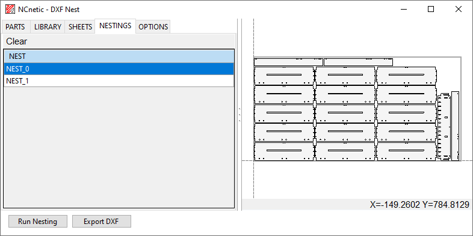

# DXFnest – The DXF Nesting Dialog

A Windows desktop dialog for nesting DXF parts.

DXFnest is part of the **[NCnetic](https://ncnetic.com)** software suite.

## Portable Version

If you are not familiar with software development and just want to **try DXFnest**, download the [portable precompiled version](https://ncnetic.com/DXFnest.zip).

## How It Works

1. Load your DXF files  
2. Manage your sheets  
3. Get the best (or at least not too bad 😉) placements  
4. Export the result as a DXF  

## Technical Information

This project is a refactoring of the [DeepNestPort](https://github.com/fel88/DeepNestPort?tab=readme-ov-file) project (which itself is a port of [DeepNest / SVGnest](https://github.com/Jack000/SVGnest)) with the following changes:

- New GUI / interface
- Improved heuristics for nesting repetitive shapes  
- Arc preservation during nesting and export — vital for CAM applications
- New shape *envelope* calculations to reduce node count, especially for geometries containing arcs  
- Use of the [ACadSharp](https://github.com/DomCR/ACadSharp) library to handle DXF files (import & export)  
- [Clipper2](https://github.com/AngusJohnson/Clipper2) C# library used for geometric calculations  
  (already present in the original DeepNestPort, but worth mentioning)
- Pure C# implementation
  
## License

This project is licensed under the **GNU General Public License v3.0 (GPL-3.0)**.

You are free to use, modify, and redistribute this software under the terms of the GPL-3.0.

## Commercial License

If you want to use DXFnest **without the obligations of the GPL-3.0** (for example, in proprietary or closed-source software), a **commercial license is available**.

For commercial licensing, please find contact information here: [https://ncnetic.com/misc/contact/](https://ncnetic.com/misc/contact/)

## User manual

### Parts tab

The Part tab allows users to import DXF geometries and set their quantities for nesting.

Click 'Import DXF' to open a file dialog and select the DXF files to import. If a DXF contains multiple parts, they are automatically divided into separate entries. If the imported DXF is organized into layers, a Layer Settings popup will appear.

Double-click an entry in the part list to set the initial quantity of a part.

Select a part and click 'Remove' to delete it, or click 'Clear' to remove all parts.

### Library tab

The Library tab provides access to a standard set of parameterizable shapes.

Click 'Add to Parts' to add the selected shape to the part list.

### Sheet tab

The Sheet tab contains the list of available sheets for nesting.

Click “Add” to create a new sheet with default parameters from the Options tab (length, width, and quantity).

Double-click an entry in the sheet list to set the length, width, and initial quantity of a sheet.

Select a sheet and click 'Remove' to delete it, or click 'Clear' to remove all sheets.

The “Load Nesting DXF” command allows you to load one or more existing nestings in DXF format. The sheet width and length are set using the default parameters from the Options tab. This function lets you add new parts from an existing nesting or simply generate a toolpath from an imported part or nesting.

### Nesting tab

The Nesting tab displays the results of the current nesting calculation.

### Options tab

__Sheet__:

| Parameter | Description |
| :--- | :--- |
| Origin | Defines the reference point for the sheet during nesting (or for the imported part when Set new origin is enabled). |
| Margins | Minimum distance between the sheet edges and the parts. |
| Part spacing | Minimum distance between parts during nesting. |
| Default sheet width | Default width for newly created sheets. |
| Default sheet height | Default height for newly created sheets. |
| Default sheet quantity | Default quantity for newly created sheets. |

__Nesting__:

| Parameter | Description |
| :--- | :--- |
| Rotations | Allowed part rotations during nesting. |
| Min internal areas | Minimum internal area (holes) considered by the nesting algorithm. |
| Pave limit | If a part's area exceeds this percentage of its bounding box area, the nesting algorithm approximates the part using its bounding box to improve performance. |

__DXF import__:

| Parameter | Description |
| :--- | :--- |
| Merge distance | Maximum distance between vertices to automatically merge overlapping points. |
| Link distance | Maximum distance to consider separate lines as connected for path creation. |
| Set new origin | Sets the origin of the imported DXF to a new point (0,0) or custom coordinates. |
| Multiplicity merge | Merge parts that have the same geometry. |
| Multiplicity merge tolerance | Tolerance on merging. |
| Merge layers | Combines multiple layers from the DXF into a single layer for processing. |
